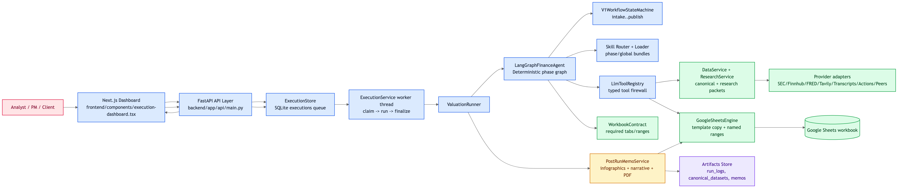
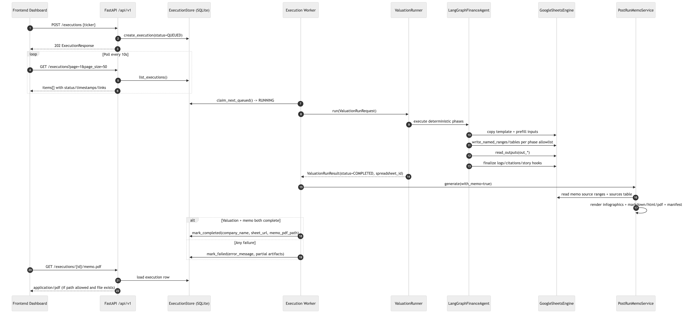
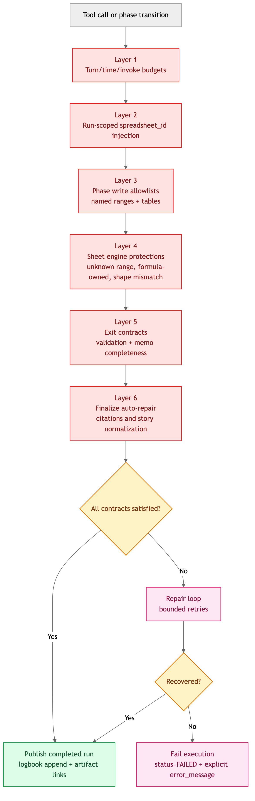
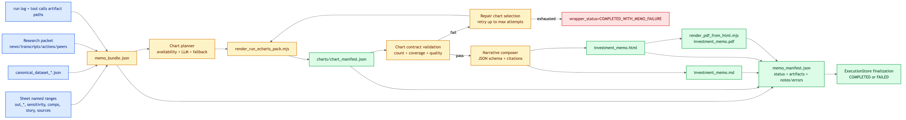
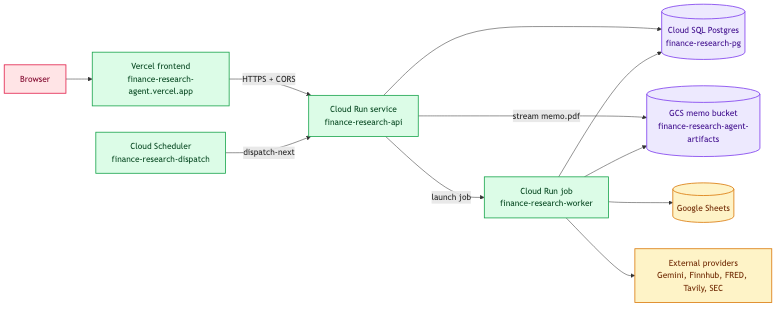
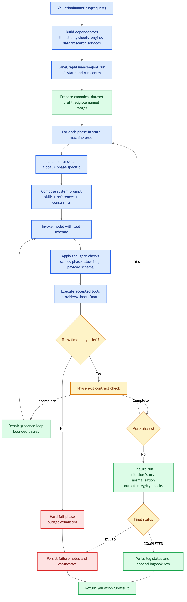
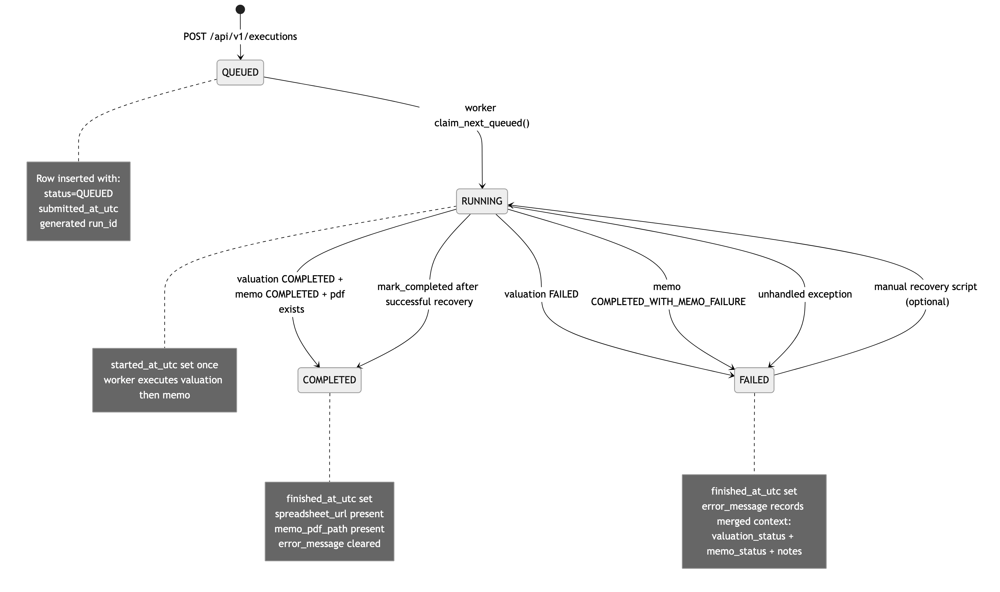

# Finance Research Agent: Complete System Design (HLD + LLD)

Live UI:
[https://finance-research-agent.vercel.app](https://finance-research-agent.vercel.app)

Last updated: 2026-03-04

## 1. Scope
This repository implements a multi-turn US stocks finance research agent that produces two client-facing deliverables per run:
1. a deterministic Google Sheets valuation workbook,
2. a local investment memo PDF.

This README is the primary system design for the agent. It captures:
1. deterministic valuation orchestration,
2. workbook and formula boundary enforcement,
3. tool and provider integration,
4. memo generation and artifact lineage,
5. API and frontend delivery for queued executions,
6. persistence, worker behavior, and observability.

## 2. Design Invariants
1. Final valuation math is formula-owned in Google Sheets and is never computed off-sheet for terminal outputs.
2. Phase order is deterministic: `intake -> data_collection -> data_quality_checks -> assumptions -> model_run -> validation -> memo -> publish`.
3. All external interactions are mediated through typed tool calls and validated payloads.
4. Citations are mandatory for non-trivial numeric and factual claims.
5. A run is operationally complete only when both the sheet and memo artifacts are available.
6. API intake must remain responsive while long-running agent executions are in progress.

## 3. Diagram Catalog
All Mermaid sources and rendered assets are cataloged in:
- `docs/system_design/diagram_manifest.json`

Markdown intentionally contains no inline Mermaid blocks. Mermaid definitions live in external `.mmd` files under `docs/system_design/mermaid/`.

## 4. High-Level Architecture
### 4.1 System Context (`m01`)


References:
1. Manifest id: `m01`
2. Source: `docs/system_design/mermaid/diagram_m01_system_context.mmd`
3. Rendered: `docs/system_design/assets/diagram_m01_system_context.png`

### 4.2 Runtime Sequence (`m02`)


References:
1. Manifest id: `m02`
2. Source: `docs/system_design/mermaid/diagram_m02_phase_execution_sequence.mmd`
3. Rendered: `docs/system_design/assets/diagram_m02_phase_execution_sequence.png`

### 4.3 Guardrail Stack (`m03`)


References:
1. Manifest id: `m03`
2. Source: `docs/system_design/mermaid/diagram_m03_guardrails_and_contracts.mmd`
3. Rendered: `docs/system_design/assets/diagram_m03_guardrails_and_contracts.png`

### 4.4 Memo Lineage (`m04`)


References:
1. Manifest id: `m04`
2. Source: `docs/system_design/mermaid/diagram_m04_memo_artifact_lineage.mmd`
3. Rendered: `docs/system_design/assets/diagram_m04_memo_artifact_lineage.png`

### 4.5 Deployed Production Topology (`m07`)


References:
1. Manifest id: `m07`
2. Source: `docs/system_design/mermaid/diagram_m07_deployed_production_topology.mmd`
3. Rendered: `docs/system_design/assets/diagram_m07_deployed_production_topology.png`

## 5. Product Contract
For every ticker run, the system must produce:
1. a copied workbook derived from the authoritative valuation template,
2. a three-scenario DCF (`pessimistic`, `base`, `optimistic`) with scenario weights,
3. source-grounded rationale logged directly into the workbook,
4. a 3-5 page investment memo with banking-style writing, charts, and explicit story-to-numbers linkage.

The memo target includes:
1. revenue and product mix,
2. company divisions and segment framing,
3. management quality,
4. sector and peer analysis,
5. opportunities and risks,
6. explicit mapping to DCF assumptions and sensitivity outputs.

## 6. Low-Level Design: Orchestration Core
### 6.1 Orchestrator LLD Flow (`m05`)


References:
1. Manifest id: `m05`
2. Source: `docs/system_design/mermaid/diagram_m05_orchestrator_ll_d_flow.mmd`
3. Rendered: `docs/system_design/assets/diagram_m05_orchestrator_ll_d_flow.png`

### 6.2 Control-Plane Modules
| Module | Responsibility |
|---|---|
| `ValuationRunner` | Assembles runtime dependencies (`llm_client`, `sheets_engine`, `data_service`, `research_service`) and returns `ValuationRunResult`. |
| `LangGraphFinanceAgent` | Owns the state graph, prompts, tool loop, phase gates, and finalize path. |
| `V1WorkflowStateMachine` | Enforces canonical phase ordering and next-phase transitions. |
| `SkillRouter` + `SkillLoader` | Materialize the correct prompt context and tool guidance for each phase. |
| `ExecutionService` | Owns queue submission, claim/dispatch, terminal status writes, and memo handoff. |

### 6.3 Core Phase Algorithm
Per phase, the agent executes:
1. load global and phase-local skills,
2. construct a constrained prompt with explicit contracts,
3. invoke the LLM with a bounded tool schema set,
4. validate and sanitize tool calls,
5. dispatch only approved tool invocations,
6. run phase exit checks,
7. execute bounded repair loops when contracts fail,
8. advance only when phase-complete conditions are satisfied.

Finalize executes:
1. output readback and integrity checks,
2. citation and story normalization,
3. formatting and sharing hooks for the workbook,
4. logbook append and final status writeback.

### 6.4 Key Phase Gates
1. `validation`: sensitivity, comps, and checks contracts must pass.
2. `memo`: story contract fields including `story_memo_hooks` must satisfy schema and quality thresholds.
3. repair loops are bounded by configured maximum pass counts.

## 7. Low-Level Design: Tooling and Data Plane
### 7.1 Tool Firewall
`LlmToolRegistry` is the primary execution firewall. It provides:
1. strict payload validation,
2. known-tool dispatch only,
3. sheet tool alias normalization,
4. structured error signaling,
5. graceful degradation for selected non-critical upstream failures.

### 7.2 Tool Groups
1. fundamentals and market ingestion,
2. rates and macro context,
3. SEC EDGAR/XBRL extraction,
4. earnings transcript ingestion,
5. corporate actions,
6. sector and peer classification,
7. contradiction and consistency checking,
8. deterministic math helpers,
9. Google Sheets read/write operations.

### 7.3 Provider Integration Pattern
Provider adapters are resolved behind normalized contracts so orchestration remains provider-agnostic:
1. SEC EDGAR/XBRL for filing-grounded metrics,
2. Finnhub for fundamentals and market data,
3. FRED/Treasury for macro rates,
4. Tavily/web search for news and external context,
5. transcript, actions, and peer providers for narrative and comp support.

### 7.4 Canonical + Research Packet Construction
1. `DataService` builds a canonical dataset for core valuation inputs and citations.
2. `ResearchService` augments the run with news, transcript signals, corporate actions, peers, and contradiction checks.
3. Canonical artifacts and traces are persisted in `artifacts/canonical_datasets/`.

## 8. Low-Level Design: Workbook and Sheets Compute Plane
### 8.1 Workbook Contract
Authoritative template:
- `Valuation_Template_TTM_TSM_RD_Lease_BankStyle_ExcelGraph_Logbook.xlsx`

Required tabs:
1. `Inputs`
2. `Dilution (TSM)`
3. `R&D Capitalization`
4. `Lease Capitalization`
5. `DCF`
6. `Sensitivity`
7. `Comps`
8. `Checks`
9. `Sources`
10. `Story`
11. `Output`
12. `Agent Log`

### 8.2 Named-Range Ownership
1. Writable surfaces: `inp_*`, story/source/log regions, comps table inputs.
2. Formula-owned surfaces: valuation engine outputs and computation layers (`calc_*`, `out_*`).
3. Agent code writes inputs and rationale; it does not perform final valuation math.

### 8.3 Sheet Write Validation Pipeline
Every write goes through:
1. workbook target resolution,
2. phase-scope validation,
3. formula-ownership protection,
4. payload coercion and matrix/scalar checks,
5. structured telemetry emission.

### 8.4 High-Signal Data Contracts
1. `sources_table`: fixed 11-column schema, absolute URLs, ISO date constraints.
2. `comps_table_full`: header + rows, target ticker must anchor the first comp row, notes quality enforced.
3. `story_memo_hooks`: strict schema with citation linkage, confidence bounds, and no unresolved range tokens.

## 9. Low-Level Design: Memo Generation Pipeline
### 9.1 Pipeline Internals
`PostRunMemoService.generate(...)` executes:
1. precondition checks (`with_memo`, valuation status, spreadsheet id),
2. bundle build (`memo_bundle.json`) from sheet + canonical + research + citations,
3. chart planning with fallback logic,
4. infographic rendering and contract validation,
5. bounded repair loops for failed chart contracts,
6. structured narrative composition,
7. markdown and HTML rendering,
8. PDF rendering,
9. manifest write (`memo_manifest.json`) with artifacts, attempts, notes, and errors.

### 9.2 Status Model
Memo wrapper statuses:
1. `SKIPPED`
2. `COMPLETED`
3. `COMPLETED_WITH_MEMO_FAILURE`

Execution row mapping:
1. execution becomes `COMPLETED` only when valuation and memo both complete and a PDF exists,
2. execution is `FAILED` otherwise, with merged failure detail preserved in `error_message`.

### 9.3 Serialization Hardening
Memo bundle and manifest serialization use custom JSON default handling so `date` and `datetime` values do not crash memo generation.

## 10. API, Queue, and Worker Design
### 10.1 Execution State Machine (`m06`)


References:
1. Manifest id: `m06`
2. Source: `docs/system_design/mermaid/diagram_m06_execution_state_machine.mmd`
3. Rendered: `docs/system_design/assets/diagram_m06_execution_state_machine.png`

### 10.2 API Endpoints
| Method | Route | Behavior |
|---|---|---|
| `POST` | `/api/v1/executions` | Validate ticker, create queued row, return `202 Accepted`. |
| `GET` | `/api/v1/executions` | Paginated, filterable execution history. |
| `GET` | `/api/v1/executions/{id}` | Return a single execution plus computed artifact URLs. |
| `GET` | `/api/v1/executions/{id}/memo.pdf` | Serve the memo artifact after path and ownership validation. |

### 10.3 Execution Persistence Model (Local SQLite, Deployed Postgres)
Table: `executions`
1. identity: `id`, `run_id`, `ticker`, `company_name`,
2. lifecycle: `status`, `submitted_at_utc`, `started_at_utc`, `finished_at_utc`,
3. artifact links: `spreadsheet_id`, `spreadsheet_url`, `memo_pdf_path`, `memo_pdf_external_url`,
4. dispatch metadata: `job_execution_name`,
5. diagnostics: `error_message`,
6. audit: `created_at_utc`, `updated_at_utc`.

Indexes:
1. status + submission timestamp for queue and history scans,
2. ticker + submission timestamp for ticker-scoped history.

Runtime model:
1. local development can still use a file-backed SQLite store,
2. deployed Cloud Run uses Postgres for shared execution state between the API service and Cloud Run jobs,
3. memo artifacts are stored in GCS in production and served back through the API.

### 10.4 Worker Semantics
1. API startup initializes the execution store and memo artifact store.
2. Local development mode can still run an in-process dispatcher thread for fast iteration.
3. Deployed mode uses `POST /api/v1/executions` to enqueue work and then dispatch at most one queued row into a Cloud Run Job launch.
4. Cloud Scheduler calls the internal dispatch endpoint every minute to continue draining the queue when the API process is idle.
5. Each Cloud Run job executes exactly one long-running valuation/memo run and writes terminal state back into Postgres.
6. Terminal state writes mark `COMPLETED` or `FAILED` atomically after valuation + memo resolution.
7. Memo PDFs are fetched from GCS by the API service and streamed back through `/api/v1/executions/{id}/memo.pdf`.

This separation is critical: the intake API must continue serving frontend polling and new submissions during long agent executions.

## 11. Frontend Design
### 11.1 UI Module Structure
1. `frontend/lib/api.ts`: typed fetch helpers and error normalization.
2. `frontend/components/execution-dashboard.tsx`: ticker submission, polling, metrics, and history table.
3. `frontend/app/page.tsx`: dashboard entry page.
4. `frontend/app/layout.tsx`: metadata, favicon wiring, root layout.
5. `frontend/app/globals.css`: premium branded layout and responsive styling.

### 11.2 UI Behavior
1. The dashboard normalizes ticker input to uppercase client-side.
2. Polling interval is 10 seconds.
3. The table exposes ticker, company name, analyzed timestamp, sheet link, memo link, and status.
4. Failed rows preserve backend diagnostics while truncating display text for table readability.
5. The app is branded as `Valence` and uses explicit SVG favicon assets.

### 11.3 Frontend Design Intent
The frontend is intentionally client-facing and premium:
1. centered, constrained page geometry,
2. institutional finance visual language,
3. durable SVG branding,
4. responsive layout across desktop and mobile,
5. readable state surfaces for queue, completion, and failure conditions.

## 12. Guardrails and Failure Semantics
### 12.1 Guardrail Layers
1. run and phase budgets,
2. tool scope enforcement,
3. phase-specific sheet write allowlists,
4. workbook schema and formula protections,
5. phase exit contracts,
6. finalize auto-repair passes.

### 12.2 Failure Classes
1. provider or network unavailability,
2. schema and shape violations,
3. citation, story, comps, and sensitivity contract failures,
4. memo chart contract failures,
5. PDF rendering failures,
6. timeout and budget exhaustion.

### 12.3 Failure Observability
1. execution row `error_message`,
2. run logs in `artifacts/run_logs/`,
3. tool call traces in canonical artifact directories,
4. memo manifest notes and error records.

## 13. Operational Runbook
### 13.1 Local Development
Backend API:
```bash
cd /path/to/finance_research_agent
PYTHONPATH=. uv run uvicorn backend.app.api.main:app --host 127.0.0.1 --port 8000
```

Frontend:
```bash
cd /path/to/finance_research_agent/frontend
npm install
NEXT_PUBLIC_API_BASE_URL=http://127.0.0.1:8000 npm run dev
```

Smoke test:
```bash
cd /path/to/finance_research_agent
PYTHONPATH=. uv run scripts/smoke_test_langgraph_runner.py --ticker ORCL --env-file .env
```

### 13.2 Deployed Production Surfaces (Current)
Current public entrypoints:
1. Frontend (Vercel): [https://finance-research-agent.vercel.app](https://finance-research-agent.vercel.app)
2. Backend API (Cloud Run): `https://finance-research-api-gfnc7q4q7a-uc.a.run.app`
3. Backend API canonical URL (Cloud Run): `https://finance-research-api-820190948453.us-central1.run.app`

Current backend deployment topology:
1. frontend is deployed on Vercel from `frontend/`,
2. public HTTP API is deployed on Cloud Run service `finance-research-api`,
3. long-running execution workers run as Cloud Run job `finance-research-worker`,
4. execution state is shared through Cloud SQL Postgres `finance-research-pg`,
5. memo artifacts are stored in GCS bucket `gs://finance-research-agent-artifacts`,
6. queue draining is driven by Cloud Scheduler job `finance-research-dispatch`,
7. CORS is configured on the API for the production Vercel origin plus localhost development origins.

Current release note:
1. the API service is on the latest image used for the HTTPS memo-link fix,
2. the worker job remains on the prior image because the latest API-only rollout changed response URL generation, not worker execution logic.

Detailed deployment history, exact commands, and current runtime state are recorded in:
1. `docs/runbooks/backend-cloud-run-deployment-memory-2026-03-04.md`

## 14. Source Layout
- `backend/`: FastAPI API, execution queue, orchestration, memo generation, tool adapters.
- `frontend/`: Next.js client for intake and execution history.
- `docs/system_design/`: diagrams, manifests, and deeper architecture artifacts.
- `tests/`: unit coverage for API, memo, tools, and orchestration guardrails.
- `artifacts/`: generated canonical datasets, run logs, memos, and related outputs.

## 15. Legacy Diagram Retention
No existing assets were deleted from `docs/system_design/assets/` or `docs/system_design/excalidraw/`.
Legacy diagram inventory remains tracked in `docs/system_design/diagram_manifest.json` under `retained_legacy_assets`.

## 16. Engineering Roadmap
1. Promote end-to-end API + memo artifact assertions into CI release gates.
2. Add authenticated API access and artifact authorization controls.
3. Add queue recovery and replay tooling for failed executions.
4. Introduce deterministic dataset caching by `(ticker, provider, endpoint, as_of)`.
5. Add explicit memo quality rubric scoring with threshold-based fail-fast enforcement.
