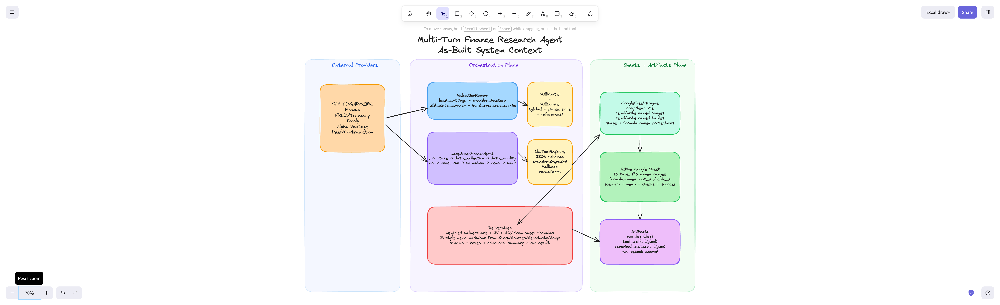
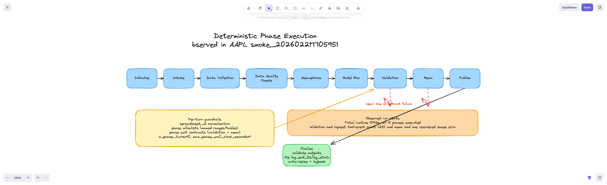
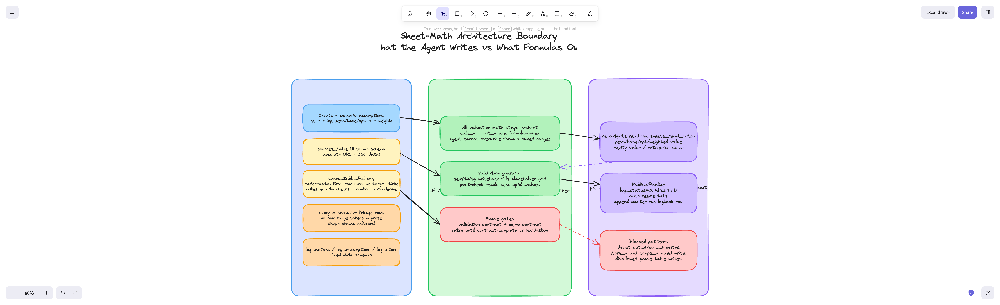
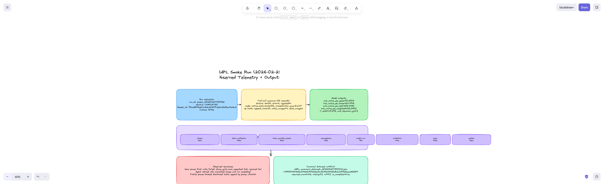

# Multi-Turn Finance Research Agent System Design
**As-Built (V1) + Recommended Target-State Improvements**

Last updated: 2026-02-22  
Evidence date: 2026-02-21 (AAPL smoke run; completed)

## 1. Executive Summary
This system is a deterministic, phase-ordered, multi-turn finance research agent that produces two outputs per ticker run:
1. A formula-driven Google Sheets valuation workbook.
2. An investment memo grounded in workbook outputs and source citations.

As-built quality highlights from the AAPL smoke run on 2026-02-21:
1. Run completed end-to-end in 1092s across 8 deterministic phases.
2. Tool telemetry recorded 60 tool calls: 58 `ok`, 1 `error`, 1 `rejected`.
3. The single `error` (memo shape mismatch) recovered within the same phase.
4. The single `rejected` event was a guardrail block (publish-phase disallowed table write), and finalize still completed successfully.
5. Core valuation outputs were read from sheet formulas only (`sheets_read_outputs`), preserving the sheet-math boundary.

## 2. Scope and Inputs Reviewed
Primary design and policy sources:
1. `AGENTS.md`
2. `phase_v1.md`

Primary implementation sources:
1. `backend/app/orchestrator/valuation_runner.py`
2. `backend/app/orchestrator/state_machine.py`
3. `backend/app/orchestrator/langgraph_finance_agent.py`
4. `backend/app/skills/catalog.py`
5. `backend/app/skills/router.py`
6. `backend/app/skills/loader.py`
7. `backend/app/tools/llm_tools.py`
8. `backend/app/tools/provider_factory.py`
9. `backend/app/tools/data_service.py`
10. `backend/app/tools/research_service.py`
11. `backend/app/sheets/google_engine.py`
12. `backend/app/workbook/contract.py`

Primary run evidence (AAPL, yesterday relative to 2026-02-22):
1. `artifacts/run_logs/smoke_20260221T105951Z.log`
2. `artifacts/canonical_datasets/smoke_20260221T105951Z_tool_calls.jsonl`
3. `artifacts/canonical_datasets/AAPL_canonical_dataset_20260221T110004Z.json`

## 3. Run Metadata and Evidence Index (AAPL 2026-02-21)
As of Sunday, February 22, 2026, this is the successful smoke run from Saturday, February 21, 2026.

| Field | Value | Evidence |
|---|---|---|
| `run_id` | `smoke_20260221T105951Z` | `artifacts/run_logs/smoke_20260221T105951Z.log:1` |
| Ticker | `AAPL` | `artifacts/run_logs/smoke_20260221T105951Z.log:1` |
| Status | `COMPLETED` | `artifacts/run_logs/smoke_20260221T105951Z.log:552` |
| Runtime | `1092s` | Derived from `run_start`/`run_end` timestamps in `artifacts/run_logs/smoke_20260221T105951Z.log:1` and `artifacts/run_logs/smoke_20260221T105951Z.log:552` |
| Model | `gemini-3-flash-preview` | `artifacts/run_logs/smoke_20260221T105951Z.log:1` |
| Run spreadsheet ID | `17DozB4f2gWUrAzKubFG87L1pZcNZd6qvSukHuNdD9ck` | `artifacts/run_logs/smoke_20260221T105951Z.log:35` |
| Run spreadsheet URL | `https://docs.google.com/spreadsheets/d/17DozB4f2gWUrAzKubFG87L1pZcNZd6qvSukHuNdD9ck/edit` | Inferred from spreadsheet ID in `artifacts/run_logs/smoke_20260221T105951Z.log:35` |
| Logbook ID | `1hVOEH09ZRboecv0qznR52grgOKOJ7z9jrY1QsoBBjOI` | `artifacts/run_logs/smoke_20260221T105951Z.log:547` |
| Logbook URL | `https://docs.google.com/spreadsheets/d/1hVOEH09ZRboecv0qznR52grgOKOJ7z9jrY1QsoBBjOI/edit` | Inferred from logbook ID in `artifacts/run_logs/smoke_20260221T105951Z.log:547` |
| Canonical dataset artifact | `artifacts/canonical_datasets/AAPL_canonical_dataset_20260221T110004Z.json` | `artifacts/run_logs/smoke_20260221T105951Z.log:555` |
| Canonical dataset SHA256 | `4f8004588d2a64bb2b9b725dec5a8b8332726bdb2a588efeeae35551947e5751` | `artifacts/canonical_datasets/AAPL_canonical_dataset_20260221T110004Z.json:247` |
| Canonical completeness | `required_count=22, missing=[], null=[], is_complete=true` | `artifacts/canonical_datasets/AAPL_canonical_dataset_20260221T110004Z.json:242` |
| Tool-call artifact | `artifacts/canonical_datasets/smoke_20260221T105951Z_tool_calls.jsonl` | `backend/app/orchestrator/langgraph_finance_agent.py:1200` |
| Run log path | `artifacts/run_logs/smoke_20260221T105951Z.log` | `artifacts/run_logs/smoke_20260221T105951Z.log:557` |

## 4. System Design Diagrams (Excalidraw)
All diagrams below were generated via Excalidraw and exported as screenshots.

### 4.1 As-Built System Context


Excalidraw:
1. Link: [diagram_01_as_built_architecture](https://excalidraw.com/#json=GRT9XBTL5-t8ICChKKaSJ,VJm-TAdpbmym5K6Blsi7Ww)
2. JSON: `docs/system_design/excalidraw/diagram_01_as_built_architecture.excalidraw.json`

### 4.2 Deterministic Phase Execution


Excalidraw:
1. Link: [diagram_02_phase_sequence](https://excalidraw.com/#json=Kf7zFFF5LHM7xpQyFXssy,kJyTCSSFu5FZW66_higlDw)
2. JSON: `docs/system_design/excalidraw/diagram_02_phase_sequence.excalidraw.json`

### 4.3 Sheet-Math Boundary


Excalidraw:
1. Link: [diagram_03_sheet_math_boundaries](https://excalidraw.com/#json=2enOtJsb8TlKiOOZSIR4i,zthYqLd-9Jtl_49AWAmj0Q)
2. JSON: `docs/system_design/excalidraw/diagram_03_sheet_math_boundaries.excalidraw.json`

### 4.4 AAPL Observed Telemetry + Outputs


Excalidraw:
1. Link: [diagram_04_aapl_run_telemetry](https://excalidraw.com/#json=kTyFlEhvje9I3knJ1F2YA,3tiqTO0hG6r9cLTTFnUVhw)
2. JSON: `docs/system_design/excalidraw/diagram_04_aapl_run_telemetry.excalidraw.json`

## 5. As-Built Architecture
The current implementation is a three-plane architecture:
1. External providers plane (SEC/FRED/Finnhub/Tavily/Alpha Vantage and peers).
2. Orchestration plane (ValuationRunner + LangGraphFinanceAgent + skill/tool routing + guardrails).
3. Sheets and artifacts plane (Google Sheets template/run sheet + artifacts/logbook).

Core assembly path:
1. `ValuationRunner` wires settings, data/research services, sheets engine, tool registry, and orchestrator graph in `backend/app/orchestrator/valuation_runner.py:37`.
2. Deterministic phases come from `WorkflowPhase` and ordered transitions in `backend/app/orchestrator/state_machine.py:8`.
3. `LangGraphFinanceAgent` builds the initialize -> phase nodes -> finalize graph in `backend/app/orchestrator/langgraph_finance_agent.py:351`.

Provider wiring:
1. Runtime provider selection and adapter construction are centralized in `backend/app/tools/provider_factory.py:47`.
2. Observed runtime provider selection in this environment:

| Plane | Selected providers |
|---|---|
| Core data | `finnhub` + `fred` + `tavily` |
| Research | `alpha_vantage` (transcripts/corporate actions), `finnhub` (peers), `rule_based` contradiction checker |

## 6. Deterministic Phase Execution and Observed Behavior
### 6.1 Canonical phase order
Phase order in code:
1. `intake`
2. `data_collection`
3. `data_quality_checks`
4. `assumptions`
5. `model_run`
6. `validation`
7. `memo`
8. `publish`

Reference: `backend/app/orchestrator/state_machine.py:24`

### 6.2 Observed phase timings (AAPL run)
| Phase | Start | End | Duration (s) | Tool events |
|---|---|---|---:|---:|
| intake | 16:30:14 | 16:32:31 | 137 | 4 |
| data_collection | 16:32:31 | 16:34:39 | 128 | 8 |
| data_quality_checks | 16:34:39 | 16:37:22 | 163 | 6 |
| assumptions | 16:37:22 | 16:39:39 | 137 | 7 |
| model_run | 16:39:39 | 16:41:15 | 96 | 1 |
| validation | 16:41:15 | 16:43:44 | 149 | 21 |
| memo | 16:43:44 | 16:45:32 | 108 | 7 |
| publish | 16:45:32 | 16:47:48 | 136 | 3 |

Evidence:
1. Starts: `artifacts/run_logs/smoke_20260221T105951Z.log:39`, `artifacts/run_logs/smoke_20260221T105951Z.log:53`, `artifacts/run_logs/smoke_20260221T105951Z.log:154`, `artifacts/run_logs/smoke_20260221T105951Z.log:189`, `artifacts/run_logs/smoke_20260221T105951Z.log:270`, `artifacts/run_logs/smoke_20260221T105951Z.log:281`, `artifacts/run_logs/smoke_20260221T105951Z.log:443`, `artifacts/run_logs/smoke_20260221T105951Z.log:494`
2. Ends: `artifacts/run_logs/smoke_20260221T105951Z.log:52`, `artifacts/run_logs/smoke_20260221T105951Z.log:153`, `artifacts/run_logs/smoke_20260221T105951Z.log:188`, `artifacts/run_logs/smoke_20260221T105951Z.log:269`, `artifacts/run_logs/smoke_20260221T105951Z.log:280`, `artifacts/run_logs/smoke_20260221T105951Z.log:442`, `artifacts/run_logs/smoke_20260221T105951Z.log:493`, `artifacts/run_logs/smoke_20260221T105951Z.log:508`

### 6.3 Turn and wall-clock hard limits
Per-phase loop and invoke constraints:
1. `max_phase_turns=10`
2. `max_phase_wall_clock_seconds=120.0`
3. `max_llm_invoke_seconds=600.0`

Reference: `backend/app/orchestrator/langgraph_finance_agent.py:240`

### 6.4 Recovery behavior observed in production run
| Event | Evidence | Outcome |
|---|---|---|
| Memo write shape mismatch (`story_grid_rows` 3x5 vs required 3x6) | `artifacts/canonical_datasets/smoke_20260221T105951Z_tool_calls.jsonl:51` and `artifacts/run_logs/smoke_20260221T105951Z.log:471` | Agent retried with corrected write payloads, memo phase completed (`artifacts/run_logs/smoke_20260221T105951Z.log:473`, `artifacts/run_logs/smoke_20260221T105951Z.log:493`) |
| Publish-phase append to disallowed table (`log_actions_table`) rejected | `artifacts/canonical_datasets/smoke_20260221T105951Z_tool_calls.jsonl:58` | Guardrail blocked invalid write; run still completed in finalize (`artifacts/run_logs/smoke_20260221T105951Z.log:550`) |

## 7. AAPL Run Telemetry and Output Snapshot
### 7.1 Tool-call telemetry summary
Source: `artifacts/canonical_datasets/smoke_20260221T105951Z_tool_calls.jsonl` (60 JSONL records).

| Dimension | Value |
|---|---|
| Total tool records | 60 |
| Status breakdown | `ok=58`, `error=1`, `rejected=1` |
| Mode breakdown | `native_bind_tools=52`, `orchestrator_guardrail=7`, `orchestrator_init=1` |
| Highest phase by tool events | `validation=23` |

Top tools by frequency:
1. `sheets_append_named_table_rows` (10)
2. `sheets_write_named_ranges` (9)
3. `sheets_read_named_ranges` (9)
4. `fetch_market_snapshot` (7)
5. `fetch_fundamentals` (7)
6. `fetch_sec_filing_fundamentals` (4)
7. `sheets_read_outputs` (3)

### 7.2 Output snapshot (formula-read values)
Reference record: `artifacts/canonical_datasets/smoke_20260221T105951Z_tool_calls.jsonl:56` (`phase=publish`, `tool=sheets_read_outputs`).

| Range | Value |
|---|---:|
| `out_value_ps_pess` | 70.27379463287647 |
| `out_value_ps_base` | 124.97456195259107 |
| `out_value_ps_opt` | 206.84654663334905 |
| `out_value_ps_weighted` | 123.58016782477611 |
| `out_equity_value_weighted` | 1827601.8916063774 |
| `out_enterprise_value_weighted` | 1949466.8916063774 |
| `OUT_WACC` | 0.095 |
| `out_terminal_g` | 0.025 |

Price-relative deltas vs `inp_px=264.58`:
1. Pessimistic: `-73.4%`
2. Base: `-52.8%`
3. Optimistic: `-21.8%`
4. Weighted: `-53.3%`

## 8. Architecture Deep Dive
### 8.1 Skills
The skill system is declarative and phase-aware:
1. `SkillSpec` catalog declares skill ID, phase, tools, tabs, and named ranges.
2. `SkillRouter` injects phase-specific skills plus `global` skills.
3. `SkillLoader` loads `SKILL.md` and shared reference bundles into phase prompts.

Code anchors:
1. Catalog definition: `backend/app/skills/catalog.py:21`
2. Router behavior: `backend/app/skills/router.py:17`
3. Loader and bundle logic: `backend/app/skills/loader.py:20`

Current catalog composition:
1. Total skills: 16
2. Phase distribution:

| Phase | Skill count |
|---|---:|
| global | 1 |
| intake | 1 |
| data_collection | 5 |
| data_quality_checks | 1 |
| assumptions | 1 |
| model_run | 1 |
| validation | 3 |
| memo | 2 |
| publish | 1 |

### 8.2 Tools
The tool layer is schema-validated and strongly typed at registry level:
1. Registry validates required payload fields before execution.
2. Tool handlers return structured JSON with normalized result envelopes.
3. Degradable external tools are isolated to avoid unnecessary hard-fail runs.

Code anchors:
1. Registry class and call path: `backend/app/tools/llm_tools.py:205`
2. Phase-V1 registry builder: `backend/app/tools/llm_tools.py:261`
3. Tool domain mapping in orchestrator: `backend/app/orchestrator/langgraph_finance_agent.py:248`

Current V1 tool registry:
1. Total tools: 18
2. Includes Sheets, SEC, fundamentals/market, rates, news, transcripts, corporate actions, peers, contradiction checking, canonical dataset utilities, and bounded Python math.

Mandatory V1 policy alignment:
1. AGENTS mandatory stack: `AGENTS.md:79`
2. V1 mandatory tool stack details: `phase_v1.md:438`

### 8.3 Guardrails
Guardrails are implemented at multiple layers.

Sheet and phase scope guardrails:
1. Force sheet operations to active run sheet (`spreadsheet_id` injection/override) in `_enforce_sheet_tool_scope`.
2. Enforce phase-level named-range and named-table allowlists in `_enforce_phase_sheet_write_allowlist`.
3. Block writes to formula-owned ranges in `GoogleSheetsEngine._validate_named_range_write_targets`.

Prompt and execution guardrails:
1. Hard system constraints in phase prompt: all ops via tools, no off-sheet valuation math, named ranges only.
2. Per-phase turn limit, wall-clock cap, invoke timeout.
3. Phase exit contracts gate `validation` and `memo` completion.

Contract and post-check guardrails:
1. Comps contract validator.
2. Sources contract validator.
3. Story contract validator.
4. Sensitivity writeback/repair when placeholder grids are detected.
5. Finalize citation/story writebacks for minimum citation integrity.

Code anchors:
1. Prompt hard constraints: `backend/app/orchestrator/langgraph_finance_agent.py:1904`
2. Loop/time guards: `backend/app/orchestrator/langgraph_finance_agent.py:1320`
3. Phase contract gating: `backend/app/orchestrator/langgraph_finance_agent.py:1534`
4. Comps validator: `backend/app/orchestrator/langgraph_finance_agent.py:2563`
5. Story validator: `backend/app/orchestrator/langgraph_finance_agent.py:2767`
6. Citation autofill guardrail: `backend/app/orchestrator/langgraph_finance_agent.py:2942`
7. Sheet formula-owned write block: `backend/app/sheets/google_engine.py:637`

### 8.4 Evals
Current test posture:
1. Unit tests: 92 total in `tests/unit`
2. Integration and eval folders are scaffold-only (`.gitkeep`)

High-signal existing unit suites:
1. `tests/unit/test_orchestrator_guardrails.py` (30)
2. `tests/unit/test_llm_tools.py` (25)
3. `tests/unit/test_google_sheets_engine_ranges.py` (11)
4. `tests/unit/test_skill_catalog.py` (6)
5. `tests/unit/test_workbook_contract.py` (1)

Gap assessment:
1. Integration/eval harness for full run quality is not yet implemented.
2. Memo quality, citation quality, and story-to-numbers coherence lack automated scoring today.

### 8.5 Citations
Citation handling is explicit in both schema and runtime contracts:
1. Sources table schema enforces 11 columns with URL/as-of/citation ID discipline.
2. Story citations are checked for valid token formats.
3. Finalize step can auto-repair `sources_table` and `story_grid_citations` from tool-call artifact evidence.
4. Source priority policy is explicitly defined as `SEC/FRED/Treasury > Alpha Vantage > Finnhub > web/news`.

Code and policy anchors:
1. Sources schema constants in tools layer: `backend/app/tools/llm_tools.py:70`
2. Sources validator: `backend/app/orchestrator/langgraph_finance_agent.py:2698`
3. Story citation token checks: `backend/app/orchestrator/langgraph_finance_agent.py:2928`
4. Source priority policy: `phase_v1.md:502`

### 8.6 Sheet Math (Architecture Boundary)
The core invariant is that final valuation math remains sheet-formula-owned.

Write/read boundary:
1. Agent writes assumptions, narrative, logs, and structured tables via named ranges/tables.
2. Agent reads final valuation outputs via `sheets_read_outputs`.
3. Direct writes to formula-owned ranges are blocked.
4. Model-run phase strips generic named-range reads and relies on output contract reads.

Code anchors:
1. Formula-driven contract requirement: `AGENTS.md:77`
2. Sheet engine output reads: `backend/app/sheets/google_engine.py:153`
3. Formula-owned range block: `backend/app/sheets/google_engine.py:637`
4. Model-run read restriction: `backend/app/orchestrator/langgraph_finance_agent.py:1815`

Observed run evidence:
1. Loaded schema reported `formula_owned=29` on active sheet (`artifacts/run_logs/smoke_20260221T105951Z.log:36`).
2. `model_run` phase had one tool event and used output reads (`artifacts/run_logs/smoke_20260221T105951Z.log:270` and `artifacts/run_logs/smoke_20260221T105951Z.log:280`).

## 9. As-Built vs Target-State Improvements
### 9.1 Summary
As-built is strong on deterministic orchestration and guardrails, but the next quality frontier is measurable memo quality, stronger citation observability, and richer integration-eval automation.

### 9.2 Recommended improvements
| Priority | Improvement | Why it matters | Concrete change |
|---|---|---|---|
| P0 | Integration eval harness | Unit tests cannot guarantee end-to-end memo/sheet quality | Add replayable run-eval suite under `tests/integration` and `tests/evals` with rubric scoring on `Output`, `Story`, `Sources`, and `Checks` tabs |
| P0 | Pre-flight shape linter for named-range writes | Prevent avoidable runtime write shape failures like observed memo mismatch | Add dry-run schema shape validation before each `sheets_write_named_ranges` tool call |
| P0 | Structured run manifest artifact | Faster debugging and reproducibility beyond log parsing | Persist per-run manifest JSON with phase timings, tool counters, non-ok events, output snapshot, and source mix |
| P1 | Citation coverage and contradiction scorecards | Improves trust and auditability for IB-style deliverables | Add per-phase citation coverage metrics and contradiction resolution outcomes in `Checks` and logbook |
| P1 | Parallel fetch + cache policy enforcement | Reduce run time and provider cost pressure | Add deterministic caching for `ticker+endpoint+period`; parallelize independent fetches in data_collection |
| P1 | Memo quality rubric gate | Current memo pass is structural, not quality-scored | Add deterministic memo rubric checks for claim-evidence linkage depth and scenario consistency |
| P2 | Policy-as-code guardrail layer | Current guards are dispersed; difficult to evolve safely | Centralize allowlists/contracts in a versioned policy module with explicit rule IDs and telemetry |
| P2 | Target-state observability dashboard | Improves operator productivity at scale | Build lightweight dashboard over run manifests for latency, failure signatures, and source-health trends |

## 10. Compliance Against Repository Contracts
Operating and workbook contracts are materially reflected in implementation:
1. Run starts by template copy (`copy_template`) and initializes workbook contract checks.
2. Multi-turn deterministic workflow with phase sequencing is implemented.
3. 3-scenario DCF output contract and weighted outputs are read from workbook outputs.
4. Valuation math boundary is enforced in sheet formulas, not off-sheet final math.
5. Rationales and logs are written to in-sheet log tables.
6. Source/citation discipline and contradiction handling are encoded in validators and policies.

Contract anchors:
1. Operating contract: `AGENTS.md:55`
2. Workbook alignment contract: `AGENTS.md:66`
3. Mandatory V1 tool stack: `AGENTS.md:79`

## 11. External References
### OpenAI
1. [Function calling | OpenAI API](https://developers.openai.com/api/docs/guides/function-calling/)
2. [Evaluation best practices | OpenAI API](https://developers.openai.com/api/docs/guides/evaluation-best-practices/)
3. [Production best practices | OpenAI API](https://developers.openai.com/api/docs/guides/production-best-practices/)

### Anthropic
1. [Implement tool use (Anthropic Docs)](https://docs.anthropic.com/en/docs/agents-and-tools/tool-use/implement-tool-use)
2. [System prompts (Anthropic Docs)](https://docs.anthropic.com/en/docs/build-with-claude/prompt-engineering/system-prompts)

### Other primary docs
1. [Google Sheets API concepts](https://developers.google.com/workspace/sheets/api/guides/concepts)
2. [Google Sheets `values.batchUpdate`](https://developers.google.com/workspace/sheets/api/reference/rest/v4/spreadsheets.values/batchUpdate)
3. [SEC EDGAR APIs](https://www.sec.gov/search-filings/edgar-application-programming-interfaces)
4. [FRED API docs](https://fred.stlouisfed.org/docs/api/fred/)
5. [Tavily Search API reference](https://docs.tavily.com/documentation/api-reference/endpoint/search)
6. [Alpha Vantage API docs](https://www.alphavantage.co/documentation/)
7. [Finnhub API docs](https://finnhub.io/docs/api)
8. [LangGraph docs](https://langchain-ai.github.io/langgraph/)
9. [Aswath Damodaran narrative-to-numbers context](https://aswathdamodaran.blogspot.com/2023/02/investing-in-end-times-narrative.html)

## 12. Reproducibility Appendix (Optional)
Recompute phase durations from log:

̊̊```bash
PYTHONPATH=. uv run python - <<'PY'
import re, datetime
from collections import OrderedDict
log='artifacts/run_logs/smoke_20260221T105951Z.log'
start,end,events={}, {}, {}
fmt='%Y-%m-%dT%H:%M:%S'
with open(log) as f:
    for line in f:
        m=re.search(r'^(\\d{4}-\\d{2}-\\d{2}T\\d{2}:\\d{2}:\\d{2}).*\\| phase_start run_id=.* phase=([a-z_]+) ',line)
        if m: start[m.group(2)] = datetime.datetime.strptime(m.group(1),fmt)
        m=re.search(r'^(\\d{4}-\\d{2}-\\d{2}T\\d{2}:\\d{2}:\\d{2}).*\\| phase_end run_id=.* phase=([a-z_]+) tool_events=(\\d+)',line)
        if m:
            end[m.group(2)] = datetime.datetime.strptime(m.group(1),fmt)
            events[m.group(2)] = int(m.group(3))
order=['intake','data_collection','data_quality_checks','assumptions','model_run','validation','memo','publish']
for ph in order:
˜
    print(ph, int((end[ph]-start[ph]).total_seconds()), events[ph])
PY
```

Recompute tool-call summary:
```bash
PYTHONPATH=. uv run python - <<'PY'
import json
from collections import Counter
p='artifacts/canonical_datasets/smoke_20260221T105951Z_tool_calls.jsonl'
rows=[json.loads(x) for x in open(p) if x.strip()]
print('records', len(rows))
print('status', dict(Counter(r['status'] for r in rows)))
print('mode', dict(Counter(r['mode'] for r in rows)))
print('phase', dict(Counter(r['phase'] for r in rows)))
print('tools', Counter(r['tool'] for r in rows).most_common(10))
PY
```
