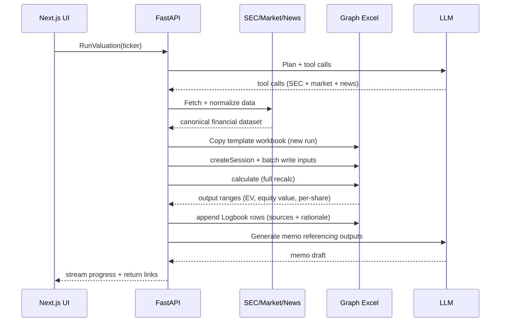

# US Stocks Valuation Agent Platform (2026)
## PRD + System Design (Excel Graph API as the Excel Engine)

> **One-liner:** Enter a US ticker → generate a **bank-style valuation workbook (Comps + DCF)** and a **professional company memo**, while writing a **step-by-step agent Logbook inside Excel** (actions, assumptions, sources, and sanity checks).

This document is a **refactor** of the earlier “Local Sandbox → GCP Deployment” agent-orchestration plan, with one major upgrade: the workbook is now operated remotely as a deterministic compute/graph via **Microsoft Graph Excel APIs** (sessions + write ranges + calculate + read outputs).  

---

## 1) What success looks like

### 1.1 User success
Within minutes, the user gets:
- **Excel model** that looks and behaves like a sell-side / IB workbook:
  - clean Inputs → Calculations → Outputs separation
  - DCF (FCFF) with sensitivities and charts
  - Comps screen and valuation summary
  - consistent formatting and print-ready layout
- **Company memo** (DOCX/MD/PDF) that:
  - references the model outputs
  - includes a clear thesis + risks + key drivers
  - maintains provenance (“where did this number come from?”)
- **Excel Logbook sheet**:
  - a readable, timestamped audit trail of the agent’s decisions
  - includes citations (SEC endpoints, market-data endpoints, or explicit assumptions)

### 1.2 Engineering success (hiring signal)
- **Deterministic compute layer**: valuation math runs in Excel, not “LLM arithmetic.”
- **Harnessed agent**: tool use is schema-validated, rate-limited, and budgeted.
- **Eval suite**: regression + invariants + peer-set sanity checks.
- **Production readiness**: traceability, retries, cost controls, and multi-user isolation.

---

## 2) Product scope (US stocks, V1)

### Inputs
- `ticker` (NASDAQ/NYSE listed)
- optional overrides:
  - risk-free rate source (default: US Treasury / FRED)
  - ERP / beta / capital structure assumptions
  - forecast horizon (e.g., 5–10y)
  - margin trajectory constraints
  - terminal growth bounds
  - comps universe filters

### Outputs
- **Excel workbook** (stored in SharePoint/OneDrive) with:
  - Dashboard
  - Historical financials
  - Assumptions
  - DCF
  - Comps
  - Sensitivities + charts
  - **Logbook**
- **Memo** (stored in GCS): investment note-style narrative with citations

### Out of scope (V1)
- Trading/broker integration (V2)
- Derivatives/options valuation
- Intraday strategies

---

## 3) ExcelGraph Engine (what changed)

### 3.1 Why Excel as the engine
Finance users trust Excel. You get:
- familiar, inspectable formulas
- auditable inputs/outputs
- native charting and a “deliverable” artifact

### 3.2 How Graph Excel APIs are used
You treat the workbook as a **remote computation graph**:
1) **Copy template workbook** to a run-scoped location (SharePoint drive folder)
2) **Create a workbook session** (Graph) for stable, performant edits
3) **Write inputs** to named ranges / tables in batches
4) **Trigger calculation** (full recalc)
5) **Read outputs** from named ranges/tables
6) **Write the Logbook** rows (what the agent did + why + sources)
7) Export:
   - workbook link
   - optional chart images (base64) for UI preview

Microsoft recommends **efficient session usage** and batching to improve performance and reliability. (Graph “Excel API best practices.”)

---

## 4) Users, use cases, stories

### Personas
- **Retail Pro / serious investor**: wants a consistent first-pass valuation and thesis.
- **Junior analyst/associate**: wants a model + memo quickly, then edits assumptions.
- **PM / IC reviewer**: wants transparency into assumptions and levers.
- **Ops/Compliance reviewer**: wants audit trail and provenance.

### User stories
- **One-click valuation**: enter ticker → model + memo generated.
- **Scenario levers**: change WACC/terminal growth/margins → re-run and see deltas.
- **Assumption explainability**: open Logbook → see rationale & sources.
- **Comps control**: user sets peer selection rules → model updates comps and multiples.
- **Cited memo**: numeric claims in memo reference SEC or market-data sources.

---

## 5) Data sources & tool options (US-optimized)

### 5.1 Official/free backbone
**SEC EDGAR APIs (data.sec.gov)**  
Use for: filings metadata, submissions, and extracted XBRL facts. SEC provides official guidance on EDGAR APIs, including fair-access limits (commonly cited: 10 requests/second) and recommends efficient scripting.  

**Rates & macro**
- **FRED API** (St. Louis Fed): risk-free proxies, macro series (optional)

### 5.2 Market data & news options (practical V1 choices)
Pick one provider for quotes/fundamentals; optionally add a news feed.

**Option A — Finnhub (recommended V1 for fast build)**
- Provides real-time market data, company fundamentals, and news endpoints.
- Pricing pages indicate a paid “stock API market data” plan around **$49.99/month**; their pricing page also lists rate limits per minute for market and fundamentals tiers (exact limits vary by plan/market).  
- Has dedicated market-news endpoints.

**Option B — Alpha Vantage (cheap starter, tight free limits)**
- Offers many endpoints free; premium is required for higher throughput.
- Their premium page notes a free usage tier with low daily request allowance (example shown: **25 requests/day**), with premium plans for higher limits.

**Option C — Polygon (now under Massive)**
- Polygon.io appears integrated into the **Massive** brand/site; treat pricing as provider-defined and verify plan entitlements before committing.
- If you need high-quality intraday/historical coverage, evaluate Massive/Polygon plans carefully for your target usage.

### 5.3 Web search
Use web search for:
- catalysts (earnings, product launches, regulation)
- competitor landscape
- risk headlines

Production guardrails:
- source allowlist for memo citations
- require citations for any factual/non-trivial numeric claims

---

## 6) System design

### 6.1 High-level architecture (Mermaid)
```mermaid
flowchart LR
  U[User] --> UI[Next.js Web App]

  UI -->|POST /run| API[FastAPI Orchestrator]
  UI <-->|SSE/WebSocket stream| API

  API --> LLM[LLM Provider\n(OpenAI/Anthropic)]
  API --> Tools[Tool Layer\n(SEC, Market Data, News, Web Search)]
  API --> Excel[ExcelGraph Engine\n(Microsoft Graph Excel API)]
  API --> Store[(Storage\nGCS + DB)]
  API --> Obs[Observability\nLogs/Traces/Metrics]

  Excel -->|Workbook stored| SP[SharePoint/OneDrive]
```

### 6.2 Key components
**Frontend (Next.js)**
- chat/task UI (ticker input + controls)
- progress streaming (agent plan + tool actions)
- workbook/memo links + chart previews

**FastAPI orchestrator**
- “agent harness”: budgets, loop detection, schema validation
- async execution using Cloud Tasks/PubSub (GCP)
- returns streaming updates to UI

**Tool layer**
- SEC fetcher (submissions + company facts + filings)
- market-data fetcher (Finnhub/AlphaVantage/Massive)
- web search + news fetcher
- canonicalizer: maps raw fields into the workbook’s tables

**ExcelGraph engine**
- copies template workbook
- opens session
- writes inputs/historicals in batch
- triggers recalc
- reads outputs
- appends logbook rows
- exports workbook link + optional chart images

**Storage**
- GCS stores memo artifacts + raw data snapshots + eval reports
- DB stores run metadata, user workspaces, budget counters, pointers to workbook drive items

---

## 7) Agent workflow (how it’s built)

### 7.1 Recommended orchestration pattern (V1)
Keep it simple:
- **One agent** with:
  - planning step
  - tool calls (structured)
  - ExcelGraph operation
  - memo generation
  - review + sanity checks

Later (V2+), add sub-agents:
- Data agent
- Modeling agent (Excel-only operations)
- Memo agent
- Reviewer agent

### 7.2 Sequence diagram (DCF run)


---

## 8) Excel template contract (agent ↔ workbook interface)

### 8.1 Workbook is an API
Define stable named ranges/tables. Examples:

**Inputs**
- `IN_Ticker`, `IN_Price`
- `IN_RiskFreeRate`, `IN_ERP`, `IN_Beta`
- `IN_TerminalGrowth`, `IN_ForecastYears`
- `IN_RevenueGrowth_1toN`, `IN_EBITMargin_1toN`
- `IN_TaxRate`, `IN_SalesToCapital` (or reinvestment rate)

**Outputs**
- `OUT_WACC`, `OUT_PV_FCFF`, `OUT_TerminalValue`
- `OUT_EquityValue`, `OUT_ValuePerShare`
- `OUT_Sensitivity_Table`, `OUT_Comps_Table`

**Logbook**
- Table `LOG_Entries`: timestamp, step, action, assumptions, sources, notes

### 8.2 Multi-user isolation
One run = one workbook copy.  
Never let two users share the same workbook instance.

---

## 9) Evals (what to build)

### 9.1 Eval categories
**Data correctness**
- revenues from SEC facts match within tolerance
- share count logic is traceable (SEC or provider)

**Model sanity (Excel invariants)**
- PV identities hold
- WACC in bounds (configurable)
- TV logic valid (terminal growth constraints)

**Comps quality**
- peer set sector/industry alignment
- cap-band rules honored
- exclude obvious mismatches

**Memo quality**
- citations for numeric claims
- section completeness
- hallucination checks via spot verification

**Tool behavior**
- loop detection (repeated tool calls)
- budget compliance (tokens + calls + time)

### 9.2 Eval operations
- 30–100 ticker benchmark set across sectors
- cache SEC responses
- run cheap checks on PR; full nightly run
- fail CI if invariants break

---

## 10) GCP deployment plan (production)

**Core services**
- Cloud Run (UI + API)
- Cloud Tasks / PubSub (async runs)
- GCS (artifacts)
- Cloud SQL (metadata)
- Secret Manager
- Cloud Logging/Trace/Monitoring

**Security**
- Microsoft Entra ID app for Graph OAuth (confidential client)
- least-privilege drive/site permissions
- per-user workspace ACLs
- store provider/LLM keys in Secret Manager

---

## 11) Cost structure (what drives spend)

### Major drivers
1) **LLM tokens** (budget per run; log usage per tool step)
2) **Market data provider** subscription and rate limits
3) **Microsoft 365 / SharePoint** (workbook storage & Graph access)
4) **GCP compute/storage**

### Concrete “starting point” costs (developer-friendly)
- **SEC EDGAR APIs**: free (respect fair-access limits; efficient scripting)
- **Finnhub**: pricing pages show stock market data plan around **$49.99/month** and list per-minute call caps for market/fundamental data
- **Alpha Vantage**: free tier has low daily request allowance; premium plans increase throughput
- **Cloud Run**: can scale-to-zero; keep first version lightweight

---

## 12) Milestones (doable + shippable)

1) **Hello ExcelGraph**
- Graph auth → copy template workbook → session → write → calculate → read → logbook append

2) **DCF V1**
- SEC ingestion + market price → populate workbook → compute outputs → export workbook

3) **Comps + memo**
- peer selection rules → comps table → memo with citations

4) **Evals + regression**
- benchmark suite + CI gate + nightly full runs

5) **Production harness**
- budgets + retries + loop detection + monitoring dashboards

---

## 13) What to cite in your repo README
- Microsoft Graph Excel best practices (sessions, batching)
- SEC EDGAR API documentation & fair-access limits
- OpenAI agent-building guides
- Anthropic posts on harnesses/evals
- Finnhub pricing + docs endpoints for news/market data

